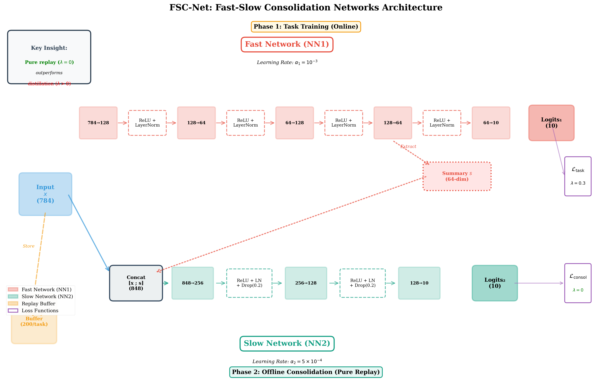

# FSC-Net: Fast-Slow Consolidation Networks

**A Dual-Timescale Neural Architecture for Continual Learning and Catastrophic Forgetting Mitigation**




[](https://www.python.org/downloads/)
[](https://pytorch.org/)
[](https://opensource.org/licenses/MIT)

---

## 📋 Table of Contents

- [Overview](#overview)
- [Key Features](#key-features)
- [Repository Structure](#repository-structure)
- [Installation](#installation)
- [Quick Start](#quick-start)
- [Experimental Results](#experimental-results)
- [Citation](#citation)
- [License](#license)

---

## 🎯 Overview

FSC-Net is a dual-timescale continual-learning framework. The system separates rapid plasticity from slow consolidation:

- **Fast Network (NN1)**: A lightweight MLP that adapts quickly to incoming tasks and produces a 64-D summary embedding.
- **Slow Network (NN2)**: A consolidation network that ingests the raw input and NN1’s summary, then rehearses replayed data to stabilise long-term knowledge.

**Headline Results (from the NeurIPS submission):**
- Split-MNIST (30 seeds): NN2 reaches **91.71% ± 0.62%** retention vs. NN1's 87.43% ± 1.27% (paired $t=23.585$, $p < 1×10^{-10}$).
- Split-CIFAR-10 (5 seeds): NN2 delivers **33.31% ± 0.38%** retention with +8.20pp gain over NN1's 25.11% ± 1.61% (paired $t=9.75$, $p < 10^{-3}$). Note: absolute performance remains below 50% chance baseline, highlighting need for stronger backbones on complex visual data.

**Key Insight:** Offline consolidation performs best with **pure replay (λ = 0)**—distillation during consolidation reintroduces recency bias. Knowledge distillation remains helpful during task training (λ = 0.3).

---

## ✨ Key Features

- **Dual-timescale optimisation**: NN1 updates rapidly while NN2 consolidates cautiously, reducing interference.
- **Architecture-agnostic methodology**: Simple MLPs match or beat more complex NN1 variants; the consolidation protocol is the differentiator.
- **Pure replay consolidation**: Offline phases use λ = 0 to avoid recency bias; distillation is reserved for in-task updates (λ = 0.3).
- **Replay-efficient**: 200 samples per task are enough to reach the reported Split-MNIST results.
- **Statistically validated**: Results averaged over 10 (MNIST) and 5 (CIFAR-10) seeds, complete with paired t-tests.

---

## 📁 Repository Structure

```
FSCNET/
├── data/                          # Datasets and archives (auto-downloaded)
│   ├── MNIST/                     # MNIST dataset
│   └── cifar-10-batches-py/       # CIFAR-10 dataset
│
├── notebooks/                     # Experiment notebooks
│   ├── ablation_nn1_architecture.ipynb
│   └── simple_mlp_experiments/
│       ├── cifar10_5seeds.ipynb
│       ├── hyperparameter_sensitivity.ipynb
│       ├── lambda_zero_investigation.ipynb
│       └── split_mnist_30seeds.ipynb
│
├── paper/                         # Manuscript and references
│   ├── fscnet_architecture.pdf
│   ├── fscnet_main.tex
│   └── references.bib
│
├── results/                       # Generated experiment artifacts
│   └── simple_mlp/
│       └── figures/               # PNG visualizations of experimental runs
│
├── src/                           # Source code
│   ├── __init__.py
│   └── models/
│       ├── __init__.py
│       ├── nn1_simple.py
│       ├── nn2_consolidation.py
│       └── training_utils.py
│
├── README.md                      # Project overview
├── requirements.txt               # Python dependencies
└── .gitignore                     # Git ignore rules

```

---

## 🔧 Installation

### Prerequisites

- Python 3.8 or higher
- CUDA-compatible GPU (recommended)
- 8GB RAM minimum

### Setup

1. **Clone the repository:**
```bash
git clone https://github.com/MedGm/FSCNET.git
cd FSCNET
```

2. **Create virtual environment:**
```bash
python -m venv .venv
source .venv/bin/activate  # On Windows: .venv\Scripts\activate
```

3. **Install dependencies:**
```bash
pip install -r requirements.txt
```

### Dependencies

Core packages:
- PyTorch >= 2.0.0
- torchvision >= 0.15.0
- numpy >= 1.24.0
- matplotlib >= 3.7.0
- pandas >= 2.0.0
- scipy >= 1.10.0

See `requirements.txt` for complete list.

---

## 🚀 Quick Start

### Running Experiments

**1. Architecture ablation (NN1 focus):**
```bash
jupyter notebook notebooks/ablation_nn1_architecture.ipynb
```
Investigates the transition from similarity-gated routing to the simpler MLP baseline.

**2. Simple MLP experiment suite:**
Open any notebook under `notebooks/simple_mlp_experiments/` (e.g. `split_mnist_30seeds.ipynb`, `cifar10_5seeds.ipynb`, `hyperparameter_sensitivity.ipynb`, `lambda_zero_investigation.ipynb`) to reproduce the continual-learning benchmarks.

### Using the FSC-Net API

```python
import torch
from src.models import (
  NN1_SimpleMLP,
  NN2_ConsolidationNet,
  ReplayBuffer,
  train_task_with_replay,
  consolidate_nn2,
  evaluate_models,
)

device = "cuda" if torch.cuda.is_available() else "cpu"

nn1 = NN1_SimpleMLP(input_dim=784, hidden_dim=128, num_classes=10).to(device)
nn2 = NN2_ConsolidationNet(input_dim=784, summary_dim=64, num_classes=10).to(device)

buffer = ReplayBuffer(buffer_size_per_task=200)
opt1 = torch.optim.Adam(nn1.parameters(), lr=1e-3)
opt2 = torch.optim.Adam(nn2.parameters(), lr=5e-4)
ce_loss = torch.nn.CrossEntropyLoss()
kl_loss = torch.nn.KLDivLoss(reduction="batchmean")

for task_id, (train_loader, test_loader) in enumerate(tasks):
  # Store representative samples from the current task
  buffer.add_task(train_loader.dataset)

  train_task_with_replay(
    nn1, nn2, train_loader, buffer.get_dataset(),
    opt1, opt2, ce_loss, kl_loss, device=device
  )

  consolidate_nn2(
    nn1, nn2, buffer.get_dataset(), opt2,
    ce_loss, kl_loss, device=device,
    lambda_distill=0.0  # pure replay during consolidation
  )

  acc1, acc2 = evaluate_models(nn1, nn2, test_loader, device=device)
  print(f"Task {task_id}: NN1={acc1:.2%}, NN2={acc2:.2%}")
```

---

## 📊 Experimental Results

### Benchmark Performance

| Benchmark | Tasks | NN1 Retention | NN2 Retention | Improvement | Notes |
|-----------|-------|---------------|---------------|-------------|-------|
| **Split-MNIST** | 5 | 87.43% ± 1.27% | **91.71% ± 0.62%** | +4.27pp | 30 seeds, paired $t=23.585$, $p < 1×10^{-10}$ |
| **Split-CIFAR-10** | 5 | 25.11% ± 1.61% | **33.31% ± 0.38%** | +8.20pp | 5 seeds, paired $t=9.75$, $p < 10^{-3}$ |

### Baseline Comparisons (Split-MNIST, 30 seeds)

| Method | Retention (± std) | Forgetting (± std) |
|--------|-------------------|---------------------|
| Fine-tuning | 21.3% ± 3.2% | 76.8% ± 3.5% |
| Replay-only | 78.4% ± 2.8% | 18.2% ± 2.1% |
| EWC | 82.1% ± 2.1% | 14.3% ± 1.8% |
| SI | 81.5% ± 2.4% | 15.1% ± 2.0% |
| **FSC-Net (NN1)** | 87.43% ± 1.27% | 9.8% ± 1.5% |
| **FSC-Net (NN2)** | **91.71% ± 0.62%** | **6.5% ± 0.7%** |

### Key Findings

1. **Methodology over architecture**: Simple NN1 MLPs outperform similarity-gated variants by ~1.2pp.
2. **Pure replay wins**: Consolidation with λ = 0 yields +1.51pp on MNIST (30 seeds, $p=0.021$) and +1.76pp on CIFAR-10 (5 seeds, $p=0.065$) versus λ = 0.5.
3. **Replay buffer is indispensable**: Removing offline consolidation or replay erodes NN2's advantage (see paper Table 6).
4. **Statistical rigor**: 30-seed validation on Split-MNIST provides tight confidence intervals (±0.62% std for NN2) and strong statistical significance ($t=23.585$, $p < 1×10^{-10}$).
5. **CIFAR-10 limitation**: While NN2 shows consistent +8.20pp improvement, absolute performance (33.31%) remains below 50% chance baseline, indicating MLP architectures are insufficient for complex visual tasks.

---

## 📖 Citation

If you use this code in your research, please cite:

```bibtex
@article{elgorrim2025fscnet,
  title={Fast-Slow Consolidation Networks (FSC-Net): A Dual-Timescale Neural Architecture for Continual Learning and Catastrophic Forgetting Mitigation},
  author={El Gorrim, Mohamed},
  year={2025},
  note={Under Review}
}
```

---

## 📄 License

This project is licensed under the MIT License - see the LICENSE file for details.

---

## 🙏 Acknowledgments

This work was inspired by:
- Complementary Learning Systems Theory (McClelland et al., 1995)
- iCaRL (Rebuffi et al., 2017)
- GEM (Lopez-Paz & Ranzato, 2017)
- SlowFast Networks (Feichtenhofer et al., 2019)

---

## 📧 Contact

For questions or collaborations:
- **Author**: Mohamed El Gorrim
- **Email**: elgorrim.mohamed@etu.uae.ac.ma
- **Issues**: Please use the GitHub issue tracker

---

**Last Updated**: November 9, 2025
